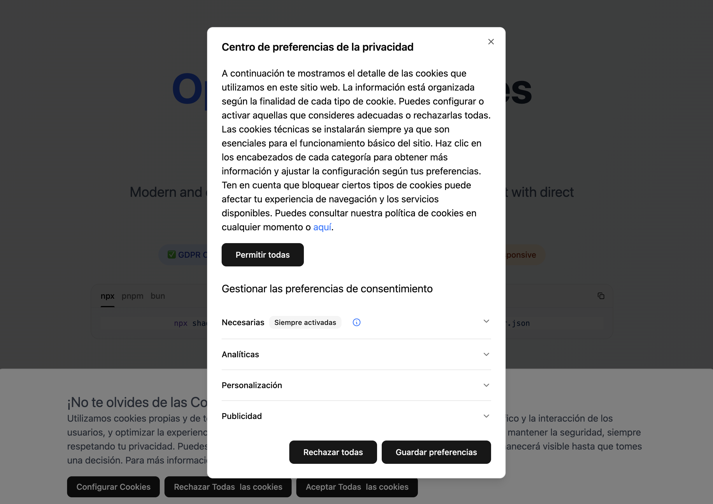

# OpenCMP Cookies Manager



OpenCMP Cookies Manager is a modern and comprehensive cookie consent management solution that simplifies the implementation of a CMP (Consent Management Platform) on your website. This tool is designed to integrate seamlessly with Google Tag Manager, providing users with an intuitive and customizable interface to configure their consent preferences.

## 🎯 Live Demo

**[👉 View Live Demo](https://jondotsoy.github.io/opencmp/)**

## 🌟 Key Features

- **Direct Google Tag Manager integration**: Automatic consent event configuration
- **Regulatory compliance**: Designed to comply with GDPR (EU General Data Protection Regulation) and CCPA (California Consumer Privacy Act)
- **Modern technology**: Built with React, Tailwind CSS and shadcn/ui
- **Easy installation**: Simple installation via shadcn CLI
- **Full control**: Completely customizable source code
- **Responsive**: Adaptive design for all devices
- **Accessible**: Meets web accessibility standards

## 🚀 Why OpenCMP?

In today's digital landscape, compliance with privacy regulations is essential. OpenCMP Cookies Manager allows you to:

- Comply with **GDPR** regulations from the European Union
- Adhere to California's **CCPA**
- Provide complete transparency about cookie usage
- Give users full control over their data
- Maintain user experience without compromising legal compliance

The platform facilitates technical implementation while ensuring your website complies with the strictest international data protection regulations.

## 📦 Quick Installation

Install OpenCMP Cookies Manager in your project using shadcn:

### NPX

```bash
npx shadcn@latest add https://jondotsoy.github.io/opencmp/cookies-manager.json
```

### PNPM

```bash
pnpm dlx shadcn@latest add https://jondotsoy.github.io/opencmp/cookies-manager.json
```

### Bun

```bash
bunx shadcn@latest add https://jondotsoy.github.io/opencmp/cookies-manager.json
```

## 🛠️ Configuration

Once installed, the component automatically integrates with your existing Tailwind CSS configuration and can be customized according to your project's specific needs.

### Usage in Astro.build

To use the component in an Astro project, import and add the component to your layout or page:

```astro
---
import {
  CookieDialogSettings,
  CookiesManager,
} from "@/components/ui/cookies-manager";
---

<CookiesManager client:only="react" />
```

### Usage in Next.js

To implement the component in Next.js, add it to your main layout:

```tsx
import {
  CookieDialogSettings,
  CookiesManager,
} from "@/components/ui/cookies-manager";

// Layout is a Server Component by default
export default function Layout({ children }: { children: React.ReactNode }) {
  return (
    <>
      <main>
        <CookiesManager />
        {children}
      </main>
    </>
  );
}
```

## ⚙️ Preferences Button

In addition to the main `CookiesManager` component, you can also implement a preferences button that allows users to access cookie settings at any time after giving their initial consent.

### Button Implementation

```tsx
import { CookieDialogSettings } from "@/components/ui/cookies-manager";

function PreferencesButton() {
  return (
    <CookieDialogSettings>
      <button className="text-sm text-blue-600 hover:text-blue-800 underline">
        Cookie Preferences
      </button>
    </CookieDialogSettings>
  );
}
```

### Usage in Different Frameworks

**In Astro.build:**

```astro
---
import { CookieDialogSettings } from "@/components/ui/cookies-manager";
---

<CookieDialogSettings client:only="react">
  <button class="text-sm text-blue-600 hover:text-blue-800 underline">
    Cookie Preferences
  </button>
</CookieDialogSettings>
```

**In Next.js:**

```tsx
import { CookieDialogSettings } from "@/components/ui/cookies-manager";

export default function Footer() {
  return (
    <footer>
      <CookieDialogSettings>
        <button className="text-sm text-blue-600 hover:text-blue-800 underline">
          Cookie Preferences
        </button>
      </CookieDialogSettings>
    </footer>
  );
}
```

The `CookieDialogSettings` component acts as a wrapper that allows opening the cookie settings dialog when the child element is clicked. You can fully customize the style and appearance of the button according to your website's design.

## 📋 Requirements

- React 18+
- Tailwind CSS
- Google Tag Manager (for full integration)

## 🤝 Contributing

Contributions are welcome. Please read our contribution guidelines before submitting a pull request.

## 📄 License

This project is licensed under the MIT License. See the [LICENSE](LICENSE) file for more details.
