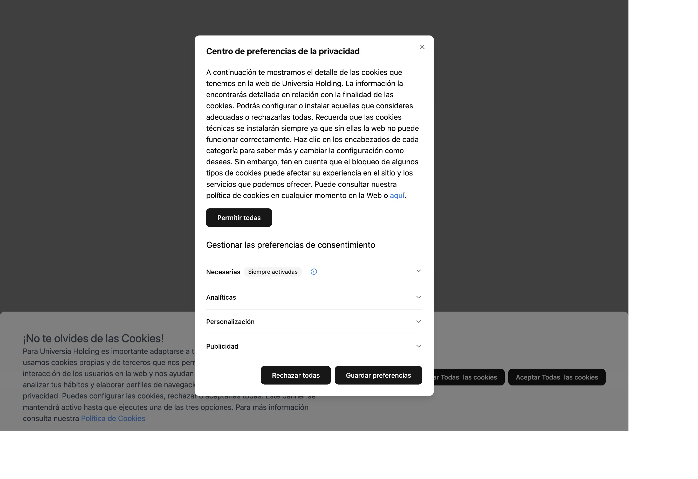

# OpenCMP Cookies Manager



OpenCMP Cookies Manager es una solución moderna y completa para la gestión de consentimiento de cookies que simplifica la implementación de un CMP (Consent Management Platform) en tu sitio web. Esta herramienta está diseñada para integrarse perfectamente con Google Tag Manager, proporcionando a los usuarios una interfaz intuitiva y personalizable para configurar sus preferencias de consentimiento.

## 🌟 Características principales

- **Integración directa con Google Tag Manager**: Configuración automática de eventos de consentimiento
- **Cumplimiento normativo**: Diseñado para cumplir con GDPR (Reglamento General de Protección de Datos de la UE) y CCPA (California Consumer Privacy Act)
- **Tecnología moderna**: Construido con React, Tailwind CSS y shadcn/ui
- **Fácil instalación**: Instalación sencilla mediante shadcn CLI
- **Control total**: Código fuente completamente personalizable
- **Responsive**: Diseño adaptativo para todos los dispositivos
- **Accesible**: Cumple con estándares de accesibilidad web

## 🚀 ¿Por qué OpenCMP?

En el panorama digital actual, el cumplimiento de las regulaciones de privacidad es fundamental. OpenCMP Cookies Manager te permite:

- Cumplir con las regulaciones **GDPR** de la Unión Europea
- Adherirse a la **CCPA** de California
- Proporcionar transparencia total sobre el uso de cookies
- Dar control completo a los usuarios sobre sus datos
- Mantener la experiencia de usuario sin comprometer el cumplimiento legal

La plataforma facilita la implementación técnica mientras garantiza que tu sitio web cumple con las normativas internacionales de protección de datos más estrictas.

## 📦 Instalación rápida

Instala OpenCMP Cookies Manager en tu proyecto usando shadcn:

### NPX

```bash
npx shadcn@latest add https://jondotsoy.github.io/cookies-manager/cookies-manager.json
```

### PNPM

```bash
pnpm dlx shadcn@latest add https://jondotsoy.github.io/cookies-manager/cookies-manager.json
```

### Bun

```bash
bunx shadcn@latest add https://jondotsoy.github.io/cookies-manager/cookies-manager.json
```

## 🛠️ Configuración

Una vez instalado, el componente se integra automáticamente con tu configuración existente de Tailwind CSS y puede ser personalizado según las necesidades específicas de tu proyecto.

### Uso en Astro.build

Para usar el componente en un proyecto de Astro, importa y añade el componente en tu layout o página:

```astro
---
import { CookieDialogSettings, CookiesManager } from "@/components/ui/cookies-manager";
---

<CookiesManager client:only="react" />
```

### Uso en Next.js

Para implementar el componente en Next.js, añádelo a tu layout principal:

```tsx
import {
  CookieDialogSettings,
  CookiesManager,
} from "@/components/ui/cookies-manager";

// Layout is a Server Component by default
export default function Layout({ children }: { children: React.ReactNode }) {
  return (
    <>
      <main>
        <CookiesManager />
        {children}
      </main>
    </>
  );
}
```

## 📋 Requisitos

- React 18+
- Tailwind CSS
- Google Tag Manager (para integración completa)

## 🤝 Contribuir

Las contribuciones son bienvenidas. Por favor, lee nuestras guías de contribución antes de enviar un pull request.

## 📄 Licencia

Este proyecto está bajo la licencia MIT. Consulta el archivo [LICENSE](LICENSE) para más detalles.
